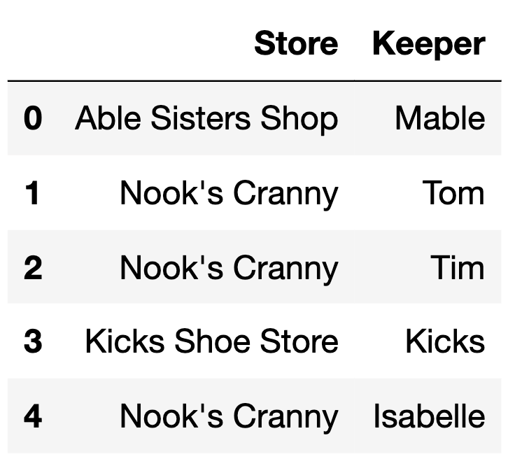

# BEGIN PROB

The DataFrame `items` describes various items available to collect or purchase using bells, the currency used in the game _Animal Crossing: New Horizons_.

For each item, we have:

- `"Item" (str)`: The name of the item.
- `"Cost" (int)`: The cost of the item in bells. Items that cost 0 bells cannot be purchased and must be collected through other means (such as crafting).
- `"Location" (str)`: The store or action through which the item can be obtained.


The first 6 rows of `items` are below, though `items` has more rows than are shown here.

<center></center>


The DataFrame `keepers` has 5 rows, each of which represent a different
shopkeeper in the *Animal Crossing: New Horizons* universe.

`keepers` is shown below in its entirety.

<center></center>

<br>

How many rows are in the following DataFrame? Give your answer as an
integer.

```py
keepers.merge(items.take(np.arange(6)), 
              left_on="Store", 
              right_on="Location")
```

# BEGIN SOLUTION

**Answer**: 10. Since the type of join is not specified, this is an inner join. Each row in `keepers` is merged with each row in `items` only if `'Store'` in `keepers` equals `'Location'` in `items`. Each row in `keepers` has the following number of merges: row 0 has 1, row 1 has 3, row 2 has 3, row 3 has 0 (there are no rows in `items` with `'Location'` equal to 'Kicks Shoe Store'), and row 4 has 3. 

1 + 3 + 3 + 0 + 3 = 10

# END SOLUTION

# END PROB