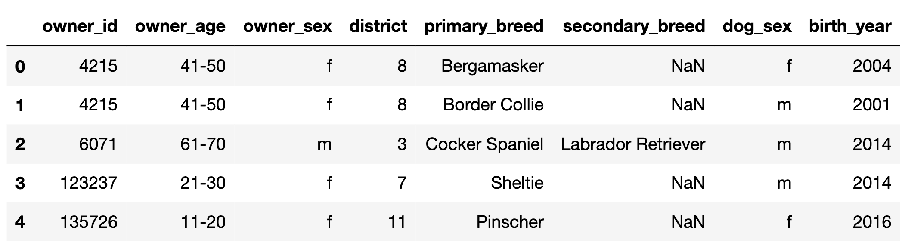

# BEGIN PROB

In this exam, we'll work with the DataFrame `dogs`, which contains one row for every registered pet dog in Zurich, Switzerland in 2017.

The first few rows of `dogs` are shown below, but `dogs` has many more rows than are shown.

<center></center>

<br>

- `"owner_id" (int)`: A unique ID for each owner. Note that, for example, there are two rows in the preview for `4215`, meaning that owner has at least 2 dogs. **Assume that if an `"owner_id"` appears in `dogs` multiple times, the corresponding `"owner_age"`, `"owner_sex"`, and `"district"` are always the same.**
- `"owner_age" (str)`: The age group of the owner; either `"11-20"`, `"21-30"`, ..., or `"91-100"` (9 possibilities in total).
- `"owner_sex" (str)`: The birth sex of the owner; either `"m"` (male) or `"f"` (female).
- `"district" (int)`: The city district the owner lives in; a positive integer between `1` and `12` (inclusive).
- `"primary_breed" (str)`: The primary breed of the dog.
- `"secondary_breed" (str)`: The secondary breed of the dog. If this column is not null, the dog is a "mixed breed" dog; otherwise, the dog is a "purebred" dog.
- `"dog_sex" (str)`: The birth sex of the dog; either `"m"` (male) or `"f"` (female).
- `"birth_year" (int)`: The birth year of the dog.

**Throughout the exam, assume we have already run `import pandas as pd` and `import numpy as np`.**

# BEGIN SUBPROB

Let $O$ be the mean of the observed ages in `dogs`, that is, the mean of
the ages that aren't missing. Let $T$ be the true mean of the ages in
`dogs`, that is, the mean we'd compute if none of the ages were missing.

What is the relationship between $O$ and $T$?

( ) $O < T$
( ) $O \approx T$
( ) $O = T$
( ) $O > T$

# BEGIN SOLUTION

**Answer**: $O < T$

In the ages we get to observe (that is, when age is not missing), we have way fewer terrier values than in the ages we don't get to observe. Terriers are older on average than the other breed classes. This means we're missing values that are larger, so when we take the average of the values we have access to, it'll be lower than the true mean.

# END SOLUTION

# END SUBPROB

Consider the following strategy for imputing missing ages.

```py
def fill_missing(dogs):
  return dogs.assign(
    age=dogs.groupby("class")["age"]
            .transform(lambda x: x.fillna(x.value_counts().idxmax()))
  )
```

# BEGIN SUBPROB

In one sentence, describe this imputation strategy.

# BEGIN SOLUTION

**Answer**: This is filling in missing ages in each breed class with the most common observed age in that breed class

# END SOLUTION

# END SUBPROB

# BEGIN SUBPROB

`small_dogs` is a subset of `dogs` shown in its entirety below.

<center></center>

If we call `fill_missing` on `small_dogs`, what values would the four
null values in the `"age"` column of `small_dogs` be replaced with?

- row 2: ___
- row 3: ___
- row 4: ___
- row 7: ___

# BEGIN SOLUTION

**Answer**:

- row 2: 5. The most common observed age for the `"Other"` breed class is 5.
- row 3: 5. The most common observed age for the `"Other"` breed class is 5.
- row 4: 12. The most common observed age for the `"Terrier"` breed class is 12.
- row 7: 7. The most common observed age for the `"Retriever"` breed class is 7.

# END SOLUTION

# END SUBPROB

# END PROB