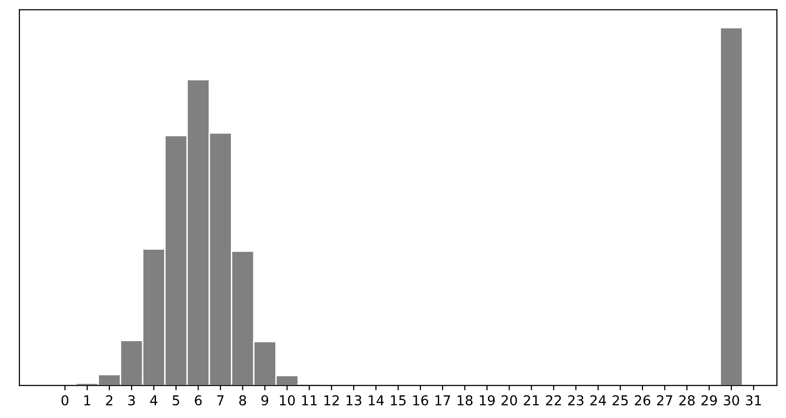

# BEGIN PROB

<!-- <i>Source: [Spring 2024 Final](../sp24-final/index.html), Problem 1</i> -->

Consider a dataset of $n$ **integers**, $y_1, y_2, ..., y_n$, whose
histogram is given below:

# BEGIN SUBPROB

Which of the following is closest to the constant prediction $h^*$ that
minimizes:

$$\displaystyle \frac{1}{n} \sum_{i = 1}^n \begin{cases} 0 & y_i = h \\ 1 & y_i \neq h \end{cases}$$

( ) $1$
( ) $5$
( ) $6$
( ) $7$
( ) $11$
( ) $15$
( ) $30$

# BEGIN SOLUTION

$30.$

The minimizer of empirical risk for the constant model when using zero-one loss is the mode.

# END SOLUTION

# END SUBPROB

# BEGIN SUBPROB

Which of the following is closest to the constant prediction $h^*$ that
minimizes: $$\displaystyle \frac{1}{n} \sum_{i = 1}^n |y_i - h|$$

( ) $1$
( ) $5$
( ) $6$
( ) $7$
( ) $11$
( ) $15$
( ) $30$

# BEGIN SOLUTION

$7.$

The minimizer of empirical risk for the constant model when using absolute loss is the median. If the bar at 30 wasn't there, the median would be 6, but the existence of that bar drags the "halfway" point up slightly, to 7.

# END SOLUTION

# END SUBPROB

# BEGIN SUBPROB

Which of the following is closest to the constant prediction $h^*$ that
minimizes: $$\displaystyle \frac{1}{n} \sum_{i = 1}^n (y_i - h)^2$$

( ) $1$
( ) $5$
( ) $6$
( ) $7$
( ) $11$
( ) $15$
( ) $30$

# BEGIN SOLUTION

$11.$

The minimizer of empirical risk for the constant model when using squared loss is the mean. The mean is heavily influenced by the presence of outliers, of which there are many at 30, dragging the mean up to 11. While you can't calculate the mean here, given the large right tail, this question can be answered by understanding that the mean must be larger than the median, which is 7, and 11 is the next biggest option.

# END SOLUTION

# END SUBPROB

# BEGIN SUBPROB

Which of the following is closest to the constant prediction $h^*$ that
minimizes:
$$\displaystyle \lim_{p \rightarrow \infty} \frac{1}{n} \sum_{i = 1}^n |y_i - h|^p$$

( ) $1$
( ) $5$
( ) $6$
( ) $7$
( ) $11$
( ) $15$
( ) $30$

# BEGIN SOLUTION

$15.$

The minimizer of empirical risk for the constant model when using infinity loss is the midrange, i.e. halfway between the min and max.

# END SOLUTION

# END SUBPROB

# END PROB
