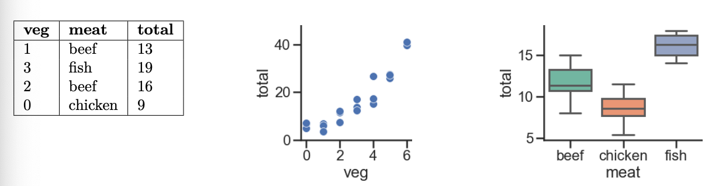

# BEGIN PROB 
Every week, Lauren goes to her local grocery store and buys a varying amount of vegetable but always buys exactly one pound of meat (either beef, fish, or chicken). We use a linear regression model to predict her total grocery bill. We've collected a dataset containing the pounds of vegetables bought, the type of meat bought, and the total bill. Below we display the first few rows of the dataset and two plots generated using the entire training set.

# BEGIN SUBPROB
Suppose we fit the following linear regression models to predict `'total'` using the squared loss function. Based on the data and visualizations shown above, for each of the following models $H(x)$, determine whether **each fitted model coefficient $w^*$** is positive ($+$), negative ($-$), or exactly 0. The notation $\text{meat=beef}$ refers to the one-hot encoded `'meat'` column with value $1$ if the original value in the `'meat'` column was `'beef'` and $0$ otherwise. Likewise, $\text{meat=chicken}$ and $\text{meat=fish}$ are the one-hot encoded `'meat'` columns for `'chicken'` and `'fish'`, respectively.

For example, in part (iv), you'll need to provide three answers: one for $w_0^*$ (either positive, negative, or 0), one for $w_1^*$ (either positive, negative, or 0), and one for $w_2^*$ (either positive, negative, or 0).

i. $H(x_i) = w_0$
ii. $H(x_i) = w_0 + w_1 \cdot \text{veg}_i$
iii. $H(x_i) = w_0 + w_1 \cdot (\text{meat=chicken})_i$
iv. $H(x_i) = w_0 + w_1 \cdot (\text{meat=beef})_i + w_2 \cdot (\text{meat=chicken})_i$
v. $H(x_i) = w_0 + w_1 \cdot (\text{meat=beef})_i + w_2 \cdot (\text{meat=chicken})_i + w_3 \cdot (\text{meat=fish})_i$

# BEGIN SOLN

**Model i. $H(x) = w_0$**
 **Answer**: $w_0^*$ must be positive

If $H(x) = w_0$, then $w_0^*$ will be the mean `'total'` value in our dataset, and since all of our observed `'total'` values are positive, their mean – and hence, $w_0^*$ – must also be positive.

 

**Model ii. $H(x) = w_0 + w_1 \cdot \text{veg}$**
 **Answer**: $w_0^*$ must be positive; $w_1^*$ must be positive

Of the three graphs provided, the middle one shows the relationship between `'total'` and `'veg'`. We see that if we were to draw a line of best fit, the $y$-intercept ($w_0^*$) would be positive, and so would the slope ($w_1^*$).

 

**Model iii. $H(x) = w_0 + w_1 \cdot \text{(meat=chicken)}$**
 **Answer**: $w_0^*$ must be positive; $w_1^*$ must be negative

Here's the key to solving this part (and the following few): the input $x$ has a `'meat'` of `'chicken'`, $H(x) = w_0 + w_1$. If the input $x$ has a `'meat'` of something other than `'chicken'`, then $H(x) = w_0$. So:

- $w_0^*$, the optimal $w_0$, should be a constant `'total'` prediction that makes sense for non-chicken inputs, and
- $w_1^*$, the optimal $w_1$, should be a number we add to $w_0^*$ to adjust the constant `'total'` prediction for chickens.

For all three `'meat'` categories, the average observed `'total'` value is positive, so it would make sense that for non-chickens, the constant prediction $w_0^*$ is positive. Based on the third graph, it seems that `'chicken'`s tend to have a lower `'total'` value on average than the other two categories, so if the input $x$ is a `'chicken'` (that is, if $\text{meat=chicken} = 1$), then the constant `'total'` prediction should be less than the constant `'total'` prediction for other `'meat'`s. Since we want `w_0^* + w_1^*` to be less than $w_0^*$, $w_1^*$ must then be negative.

 

**Model iv. $H(x) = w_0 + w_1 \cdot \text{(meat=beef)} + w_2 \cdot \text{(meat=chicken)}$**
 **Answer**: $w_0^*$ must be positive; $w_1^*$ must be negative; $w_2^*$ must be negative

$H(x)$ makes one of three predictions:

- If $x$ has a `'meat'` value of `'chicken'`, then it predicts $w_0 + w_2$.
- If $x$ has a `'meat'` value of `'beef'`, then it predicts $w_0 + w_1$.
- If $x$ has a `'meat'` value of `'fish'`, then it predicts $w_0$.

Think of $w_1^*$ and $w_2^*$ – the optimal $w_1$ and $w_2$ – as being adjustments to the mean `'total'` amount for `'fish'`. Per the third graph, `'fish'` have the highest mean `'total'` amount of the three `'meat'` types, so $w_0^*$ should be positive while $w_1^*$ and $w_2^*$ should be negative.

 

**Model v. $H(x) = w_0 + w_1 \cdot \text{(meat=beef)} + w_2 \cdot \text{(meat=chicken)} + w_3 \cdot \text{(meat=fish)}$**
 **Answer**: Not enough information for any of the four coefficients!

Like in the previous part, $H(x)$ makes one of three predictions:

- If $x$ has a `'meat'` value of `'chicken'`, then it predicts $w_0 + w_2$.
- If $x$ has a `'meat'` value of `'beef'`, then it predicts $w_0 + w_1$.
- If $x$ has a `'meat'` value of `'fish'`, then it predicts $w_0 + w_3$.

Since the mean minimizes mean squared error for the constant model, we'd expect $w_0^* + w_2^*$ to be the mean `'total'` for `'chicken'`, $w_0^* + w_1^*$ to be the mean `'total'` for `'beef'`, and $w_0^* + w_3^*$ to be the mean total for `'fish'`. The issue is that there are infinitely many combinations of $w_0^*, w_1^*, w_2^*, w_3^*$ that allow this to happen!

Pretend, for example, that:

- The mean `'total'` for `'chicken` is 8.
- The mean `'total'` for `'beef'` is 12.
- The mean `'total'` for `'fish'` is 15.

Then, $w_0^* = -10, w_1^* = 22, w_2^* = 18, w_3^* = 25$ and $w_0^* = 20, w_1^* = -8, w_2^* = -12, w_3^* = -5$ work, but the signs of the coefficients are inconsistent. As such, it's impossible to tell!

# END SOLN
# END SUBPROB

# BEGIN SUBPROB

Suppose we fit the model $H(x_i) = w_0 + w_1 \cdot \text{veg}_i + w_2 \cdot (\text{meat=beef})_i + w_3 \cdot (\text{meat=fish})_i$.
After fitting, we find that $\vec{w^*}=[-3, 5, 8, 12]$

What is the prediction of this model on the **first** point in our dataset?

( ) -3
( ) 2
( ) 5
( ) 10
( ) 13
( ) 22
( ) 25

# BEGIN SOLN
**Answer**: 10

Plugging in our weights $\vec{w}^*$ to the model $H(x)$ and filling in data from the row

| veg | meat | total |
|-----|------|-------|
| 1   | beef | 13    |

 

gives us $-3 + 5(1) + 8(1) + 12(0) = 10$.

# END SOLN
# END SUBPROB

# BEGIN SUBPROB

Following the same model $H(x)$ and weights from the previous problem, what is the loss of this model on the **second** point in our dataset, using squared error loss?

( ) 0
( ) 1
( ) 5
( ) 6
( ) 8
( ) 24
( ) 25
( ) 169

# BEGIN SOLN
**Answer**: 25

The squared loss for a single point is $(\text{actual} - \text{predicted})^2$. Here, our actual `'total'` value is 19, and our predicted value `'total'` value is $-3 + 5(3) + 8(0) + 12(1) = -3 + 15 + 12 = 24$, so the squared loss is $(19 - 24)^2 = (-5)^2 = 25$.

# END SOLN
# END SUBPROB
# END PROB