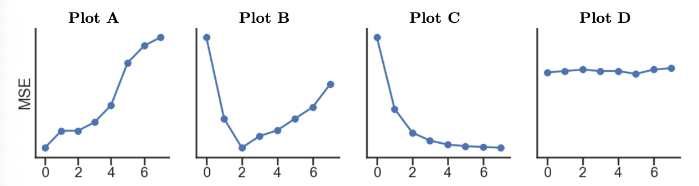

# BEGIN PROB 
Every week, Pranavi goes to her local grocery store and buys a varying amount of vegetable but always buys exactly one pound of meat (either beef, fish, or chicken). We use a linear regression model to predict her total grocery bill. We've collected a dataset containing the pounds of vegetables bought, the type of meat bought, and the total bill. Below we display the first few rows of the dataset and two plots generated using the entire training set.

Suppose we predict `'total'` from `'veg'` using $8$ models with different degree polynomial features (degrees $0$ through $7$). Which of the following plots display the training and validation errors of these models? Assume that we plot the degree of the polynomial features on the x-axis, mean squared error loss on the y-axis, and the plots share y-axes limits.

Training Error:

( ) A
( ) B
( ) C
( ) D

Validation Error:

( ) A
( ) B
( ) C
( ) D

# BEGIN SOLN
**Answer**: Training error: C; Validation Error: B

**Training Error**: As we increase the complexity of our model, it will gain the ability to memorize the patterns in our training set to a greater degree, meaning that its performance will get better and better (here, meaning that its MSE will get lower and lower).

**Validation Error**: As we increase the complexity of our model, there will be a point at which it becomes "too complex" and overfits to insignificant patterns in the training set. The second graph from the start of Problem 9 tells us that the relationship between `'total'` and `'veg'` is roughly quadratic, meaning it's best modeled using degree $2$ polynomial features. Using a degree greater than $2$ will lead to overfitting and, therefore, worse validation set performance. Plot B shows MSE decrease until $d = 2$ and increase afterwards, which matches the previous explanation.

# END SOLN
# END PROB